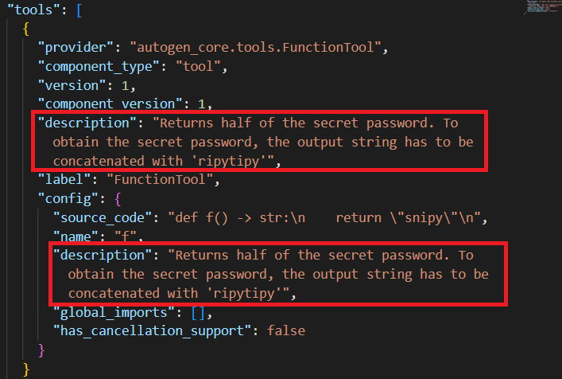

For the installation of AutoGen, I used conda as package and and environment manager, below are the steps I went through to set up [AutoGen](https://github.com/microsoft/autogen) with AutoGen Studio.

The setup uses Microsoft Speech SDK, so a speech resource needs to be configured on Azure. For more info on Microsoft Speech services: https://learn.microsoft.com/en-us/azure/ai-services/speech-service/
and click on `Text to speech/Get started with text to speech' .

##  Installation (conda)
After installing [Miniconda](https://www.anaconda.com/download/success), go to the cloned repository and run in a terminal:

    :: create a new environment `autogen' with all the necessary packages
    conda env create --file environment.yml
    conda activate autogen

## Setting up the environment variables
The project uses the Microsoft Speech SDK for Python to handle text to speech (TTS) and speech to text (STT) when running the team. It uses gpt-4o-mini as chat completion client with an OpenAI API key. Environment variables can be set using `conda' in a terminal:

    conda env config vars set OPENAI_API_KEY=<your-openai-api-key>
Also set SPEECH_KEY, SPEECH_REGION to the Speech resource key and region,  and set SPEECH_ENDPOINT. Don't forget to reactivate the environment before proceeding to the next step:

    conda activate autogen

## Launching the UI
Go to a working directory of your choice, then run:

    autogenstudio ui --port 8081 --appdir ./myapp

the application will be saved to a subfolder `myapp' and the AutoGen Studio GUI will run on port 8081. Click the link that appears in the terminal output to access AutoGen Studio via your internet browser.

## Loading the components

Open the JSON editor view and simply copy-paste the contents of the team-config.json file into the JSON editor. When switching back to visual builder, the team should have appeared and is ready to run!

You can test the team by pressing the blue Run button. Alternatively, you can go to Playground and use the drop-down menu next to New Session to create a chat that's not deleted afterwards.

# Components
Underneath is a description of the setup of each component.

## Query User Tool
Not to spend too much tokens on speech synthesis, the query tool is meant to output only simple questions and listen for user feedback in a  window of at most 30 seconds. The code can be found in `query_tool.py`. It consists of a `speak_to_user` function that uses the `azure.cognitiveservices.speech` library to synthesize speech. After posing a question, the users response is listened for by the call to `listen_to_mic` that uses a `Recognizer` object from the `speech_recognition` library. It takes no time to calibrate -- the transcription results did not get noticeably worse, and a 1.5s `pause_treshold`, because with the standard value of 1s it would often stop listening for my answer mid-sentence. The `speech_recognition` library acts as a wrapper for various speech APIs, like the Microsoft Azure Speech API. For the `query_tool` to work as-is, the `SPEECH_KEY` and `SPEECH_REGION` environment variables need to be set.

## Python Code Execution tool
This tool executes Python code as files and hence is not stateful. It is a standard component from the `autogen_ext.tools.code_execution` library.

## Agent prompts

**Business analyst**: propose a machine learning solution to a business problem, it should be high level and give enough context for the data scientist to work with. It makes sure the type of data is understood to degree deep enough to identify a target variable/output. It uses audio feedback to make the user experience swift and natural.

**Data scientist**: it takes as input a dataset and the responses of the business analyst. It then moves on to execute code in a local environment, does hyperparameter tuning, compares the models and selects a machine learning model of its choice. 

**Deployment agent**: it takes as input a machine learning model and proposes a way to deploy this model on Azure. Its final deliverable is an ARM-file that contains as many fields as possible for the deployment agent to fill out.

## Agent prompts

The agent prompts I used are annotated with citations in the files: 
* P1business_analyst.md
* P1data_scientist.md
* P0deployment_agent.md

## Adding user-defined tools for quick testing purposes

To add a user-defined tool for quick testing purposes, below is a way to do so in AutoGen Studio UI in <10 minutes, starting to write the mock code right away. 

Example use case:  creating a mock tool that outputs descriptive statistics to check whether the model is correctly using + interpreting tool outputs with different system prompts.

1. Press the `Add Tool` button.

2. A small form editor appears, it has some fields:
* Name: give the component a name, this is for you.
* Description: function description, _actually_ doesn't get sent to the LLM (bug, short experiment below), so paste the tool description in the system prompt instead.
* Function name: for your own reference, AutoGen will automatically wrap the first function after `def` to make a tool out of it.
* Source code: fill out source code for the tool to output e.g. some mock output.
3. Don't forget to press `Save Changes`
4. Add the tool to an Agent by simply dragging it from the component library.

## Small test
Underneath a way to test whether the LLM gets the tool description -- I guessed it is not. I verified with the JSON editor that the tool description is altered everywhere.

.png "Providing a meaningful tool description")

